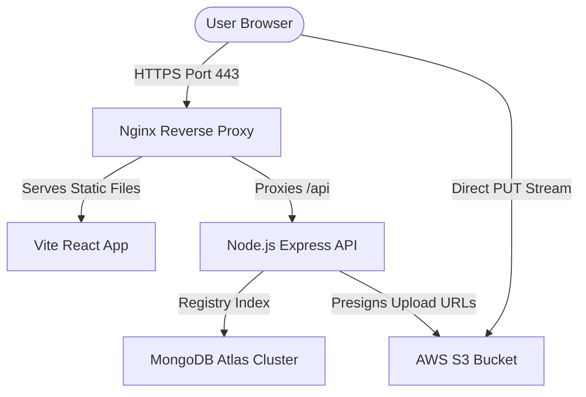

# CloudVault (Micro Google Drive Document SaaS)

CloudVault is a premium, high-performance, and high-contrast Cloud Storage Document SaaS application. It provides users with a clean, flat-rate **20 GB of free cloud vault space** (with zero subscription popups or lockouts) to upload, organize, star, share, and manage files securely.

---

## Technical Stack & Architecture



- **Frontend**: Vite + React, Vanilla CSS + Tailwind, Lucide React Icons.
- **Backend**: Node.js, Express, Mongoose, AWS SDK (S3 client).
- **Database**: MongoDB (Atlas cloud-managed).
- **Storage**: AWS S3 Bucket (direct client-side uploads via secure presigned PUT URLs to avoid server bottlenecking).
- **Server**: AWS EC2 instance (Ubuntu LTS), reverse-proxied via Nginx, kept active using PM2, encrypted with Let's Encrypt SSL.

---

## Core Features

- **Flat-Rate Capacity**: Strictly 20 GB of free storage for all users.
- **High-Contrast Badges**: Easy-to-see sharing status badges (Public vs Private) optimized for both light and dark themes.
- **Hierarchical Folders**: Create folders, browse documents hierarchically, and move files easily.
- **Secure Link Sharing**: Toggle secure link-sharing on and off; shared links automatically expire after 24 hours.
- **Interactive Chat Assistant**: Bottom-right floating HelpBot helping users navigate upload flows, trashing, and capacity queries.
- **Soft-Deletion (Trash Bin)**: Guard rails preventing accidental data loss; files must be moved to the Trash bin before permanent purging.

---

## Local Development Setup

### Prerequisites
- Node.js (v18 or higher)
- MongoDB installed locally (or a MongoDB Atlas connection URI)
- (Optional) AWS Account with S3 bucket for file uploads

### 1. Setup Backend
1. Navigate to the backend directory:
   ```bash
   cd backend
   ```
2. Install dependencies:
   ```bash
   npm install
   ```
3. Create a `.env` file inside the `backend` folder:
   ```ini
   PORT=5001
   JWT_SECRET=super_secret_jwt_key_for_micro_google_drive
   MONGODB_URI=mongodb://127.0.0.1:27017/micro-google-drive
   
   # Optional: Configure S3 (If missing, it runs in local mock file upload mode)
   AWS_ACCESS_KEY_ID=your_aws_key
   AWS_SECRET_ACCESS_KEY=your_aws_secret
   AWS_REGION=us-east-1
   AWS_BUCKET_NAME=your_s3_bucket_name
   ```
4. Start the backend:
   ```bash
   npm run dev
   ```

### 2. Setup Frontend
1. Navigate to the frontend directory:
   ```bash
   cd ../frontend
   ```
2. Install dependencies:
   ```bash
   npm install
   ```
3. Start the Vite development server:
   ```bash
   npm run dev
   ```
4. Open your browser and navigate to `http://localhost:5173`.

---

## Production AWS Deployment Guide

The workspace includes scripts to automate the packaging and EC2 configuration.

### 1. Locally Bundle the Application
From the project root on your Mac, run:
```bash
./deploy-package.sh
```
This builds the production React assets and zips the backend codebase and built frontend into `cloudvault-deploy.zip` in the root folder.

### 2. Upload Bundle to AWS EC2
Upload the deployment zip and setup script to your Ubuntu server:
```bash
scp -i /path/to/your-key.pem cloudvault-deploy.zip ec2-setup.sh ubuntu@YOUR_EC2_PUBLIC_IP:~
```

### 3. Server Setup (Nginx, Node, PM2)
SSH into your EC2 instance and run the setup automator:
```bash
ssh -i /path/to/your-key.pem ubuntu@YOUR_EC2_PUBLIC_IP
chmod +x ec2-setup.sh
sudo ./ec2-setup.sh
```
This installs Node.js, Nginx, and PM2, and configures the default reverse proxy settings.

### 4. Deploy and Launch Backend
Extract the bundle on the EC2 server and configure environment secrets:
```bash
# Unpack
unzip -o ~/cloudvault-deploy.zip -d ~/
rm -rf /var/www/cloudvault/frontend-dist/*
mv -f ~/deploy/frontend-dist/* /var/www/cloudvault/frontend-dist/
mv -f ~/deploy/backend/* /var/www/cloudvault/backend/
rm -rf ~/deploy

# Configure production variables
sudo nano /var/www/cloudvault/backend/.env
```
Paste your production configuration including S3 credentials and MongoDB Atlas connection strings into the editor, then save.

Now run:
```bash
cd /var/www/cloudvault/backend
npm install --omit=dev
pm2 start server.js --name "cloudvault-api"
pm2 save
sudo env PATH=$PATH:/usr/bin /usr/lib/node_modules/pm2/bin/pm2 startup systemd -u ubuntu --hp /home/ubuntu
```

### 5. DNS and SSL Configuration (Free HTTPS)
1. Point your domain (e.g., via DuckDNS or Route 53) to the EC2 Public IP.
2. Edit Nginx server block:
   ```bash
   sudo nano /etc/nginx/sites-available/cloudvault
   ```
   Replace `server_name _;` with your domain: `server_name yourdomain.com;`.
3. Restart Nginx and request certificate:
   ```bash
   sudo systemctl restart nginx
   sudo apt install -y python3-certbot-nginx
   sudo certbot --nginx -d yourdomain.com
   ```

---

## API Endpoints List

### Authentication
- `POST /api/auth/signup` - Register a new user account.
- `POST /api/auth/login` - Authenticate credentials and return JWT.

### File Operations (JWT Header Required)
- `GET /api/files/upload-url` - Returns an S3 presigned PUT URL and key for direct uploading.
- `POST /api/files/save-metadata` - Saves file metadata into MongoDB after successful upload.
- `GET /api/files/my-files` - List all files owned by the logged-in user.
- `PUT /api/files/rename/:fileId` - Renames an existing file registry.
- `PUT /api/files/star/:fileId` - Toggles the starred/important status.
- `PUT /api/files/move/:fileId` - Moves file to another folder (or `Root`).
- `POST /api/files/share/:fileId` - Toggles public link sharing status (valid for 24 hours).
- `PUT /api/files/trash/:fileId` - Soft-deletes a file (moves to Trash) or restores it.
- `DELETE /api/files/:fileId` - Permanently deletes a file from storage and database registry (must be in Trash first).

### Folder Operations (JWT Header Required)
- `POST /api/files/folders` - Create a new folder.
- `GET /api/files/folders` - List all user folders.

### Public Downloads
- `GET /api/files/download/:s3Key` - Resolves to S3 GET url or local file stream (valid if owner requested or link is shared and unexpired).
